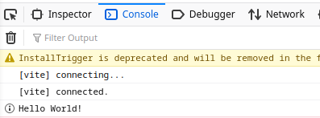

# How to create a package

Packages are the building blocks of which an application is composed.
They can contain code, UI components, styles, services, translation files etc.
At their core, they are simply [Node packages](https://nodejs.org/api/packages.html) with a few extensions.

> **Note**
> Application packages are packages like all others.
> They just have a few additional capabilities.

## Background

Every locally developed package must contain a `package.json` and a `build.config.mjs`.
The `package.json` file is required by Node and PNPM, while the `build.config.mjs` is used to implement our extensions (services etc.).

By convention, most packages are placed into `src/packages/../<PACKAGE_NAME>`.
However, they can be placed anywhere within the `src` directory: every `package.json` in the source directory is detected by pnpm as part of the workspace (see `pnpm-workspace.yaml`),
and all packages in the workspace may reference each other ([more details](https://pnpm.io/workspaces)).

## Required files

We will create a package called `hello-world` that exports a simple function:

```jsonc
// src/packages/hello-world/package.json
{
    "name": "hello-world",
    "private": true
}
```

```js
// src/packages/hello-world/build.config.mjs
import { defineBuildConfig } from "@open-pioneer/build-support";

// The empty object is the minimal configuration.
// We're not going to use any custom features from the pioneer framework for now.
export default defineBuildConfig({});
```

Run `pnpm install` to ensure that `pnpm` knows about our new package.
pnpm provides powerful tools to work with the local workspace, we can use this to verify our setup:
you can run `pnpm ls -r --depth -1` (optionally with `--json`) to print all local packages.

```plain
$ pnpm ls -r --depth -1 --json
// ...
    {
        "name": "hello-world",
        "path": "<PROJECT_PATH>/src/packages/hello-world",
        "private": true
    },
// ...
```

## Entry point

Since we want to provide a plain function to other packages, we must create a module from which that function can be imported.
Modules (i.e. `.js` or `.ts` files) that are designed to be imported from other packages (i.e. they are not private) are also called _entry points_.
We only need a single one, which we will call `index.ts`:

```ts
// src/packages/hello-world/index.ts
export function greet(target = "World") {
    console.info(`Hello ${target}!`);
}
```

Next, we will edit our `package.json` to declare `index.ts` as our package's [main entry point](https://docs.npmjs.com/cli/v9/configuring-npm/package-json#main).
This will ensure that when someone imports `"hello-world"`, she will receive the exports from `index.ts`.

```jsonc
// src/packages/hello-world/package.json
{
    "name": "hello-world",
    "private": true,
    "main": "index.ts"
}
```

> **Note**  
> We're currently not enforcing most imports between packages.
> That means that you're technically able to import internal modules that happen to live in the package's directory.
> In the future, we will likely implement a lint to prevent this to enforce clean usage of dependencies.
>
> For the time being, we recommend consulting a package's documentation for public entry points
> and not relying on implementation details of other packages.

## Using the package

The last step is to actually use the function from one of our apps.
For that, we're going to extent this project's empty starting app in `src/apps/empty`.

First, start the development server:

```bash
$ pnpm run dev
```

Then, open the test site for the empty app, usually at <http://localhost:5173/sites/empty/>.

In order to use the new package, it must be declared as a dependency in your app's `package.json`:

```jsonc
// src/apps/empty/package.json
{
    "name": "empty",
    "private": true,
    "dependencies": {
        "@open-pioneer/runtime": "workspace:^",
        "@open-pioneer/chakra-integration": "workspace:^",
        // Add this line:
        "hello-world": "workspace:*"
    }
}
```

> **Note**  
> The `workspace:` protocol instructs pnpm to always install the referenced package from the local workspace.
> _Installation_ in this case means simply linking the packages together: `node_modules` will contain symlinks ([read more](https://pnpm.io/workspaces#workspace-protocol-workspace)).

At this point, your browser will likely display an error because the dependency cannot be found.
We have to run `pnpm install` after editing the dependencies, then reload your browser: the error will be gone.

Finally, we can use `greet` function from the `hello-world` package.
We'll simply edit the `app.ts`:

```ts
import { createCustomElement } from "@open-pioneer/runtime";
import * as appMetadata from "open-pioneer:app";
import { AppUI } from "./AppUI";

// Imports the function from `hello-world/index.ts`
import { greet } from "hello-world";

// Simply calls the function when the module is loaded.
greet();

const Element = createCustomElement({
    component: AppUI,
    appMetadata
});

customElements.define("empty-app", Element);
```

Open your browser's console to see the result:



## Further reading

-   TODO: How to create UI components
-   [How to create a service](./HowToCreateAService.md)
-   [Package Reference](../reference/Package.md)
